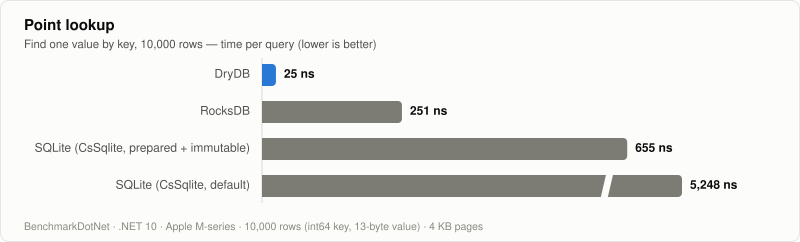
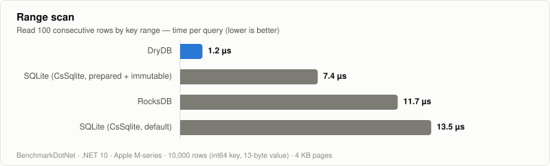
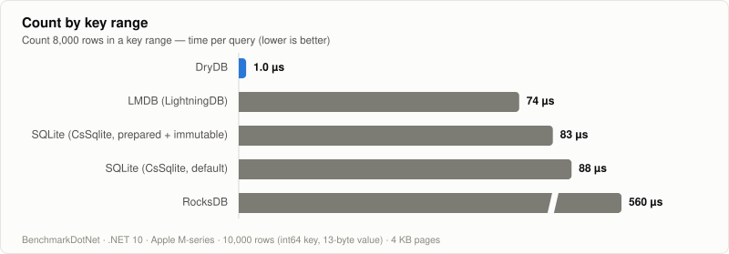

# DryDB

> [!NOTE]
> This project was formerly known as **VKV** and has been renamed to **DryDB**.

DryDB is a read-only embedded B+Tree based key/value database, implemented pure C#.

<picture>
  <source media="(prefers-color-scheme: dark)" srcset="docs/benchmarks/point_lookup_dark.svg">
  
</picture>

See [Performance](#performance) for details.

## Features

- B+Tree based query
  - Read a value by primary key 
  - Read values by key range
  - Read values by key prefix 
  - Count by key range
  - Secondary index
    - unique
    - non-unique
- Multiple Tables
- Support for both async and sync
- Sort by asc/desc
- C# Serialization
  - MessagePack
  - (Other formats are under planning.  
- Unity Integration
  - `AsyncReadManager` + `NativeArray<byte>` based optimized custom loader.
- Custom key encoding
  - Simple ascii/u8 byte sequence string (default)
  - Int64
  - UUIDv7 (only for .NET 9 or later. Needs `Guid.CreateVersion7()`)
  - Ulid
- Page filter
  - Built-in filters
      - Cysharp/NativeCompression based page compression.
  - We can write custom filters in C#.
- Iterator API
  - By manipulating the cursor, large areas can be accessed sequentially.
- CLI tool
- Support for large BLOBs. (Values exceeding 65,536 bytes are stored on a separated page.)

## Performance

All benchmarks read a table of 10,000 rows (int64 primary key, 13-byte value) with 4 KB pages, on Apple M-series / .NET 10, measured with BenchmarkDotNet. Lower is better.

Two SQLite configurations are shown to keep the comparison fair:

- **default** — a command is created and parsed for every query (typical naive usage)
- **prepared + immutable** — the statement is prepared once and reused, and the file is opened with [`immutable=1`](https://www.sqlite.org/uri.html#uriimmutable), the fastest read-only setup SQLite offers

LMDB is measured through [LightningDB](https://github.com/CoreyKaylor/Lightning.NET), opened read-only (`ReadOnly | NoLock`, 4 KB pages) with a single long-lived read transaction and database handle reused across queries — the fastest read pattern LMDB offers. Values are zero-copy views into its memory map.

### Point lookup

<picture>
  <source media="(prefers-color-scheme: dark)" srcset="docs/benchmarks/point_lookup_dark.svg">
  
</picture>

### Range scan

<picture>
  <source media="(prefers-color-scheme: dark)" srcset="docs/benchmarks/range_scan_dark.svg">
  
</picture>

### Count by key range

<picture>
  <source media="(prefers-color-scheme: dark)" srcset="docs/benchmarks/count_range_dark.svg">
  
</picture>

<details>
<summary>Raw BenchmarkDotNet results</summary>

Each benchmark class is measured in its own run. 1 op = 1000 queries for point lookup, 100 queries for range scan and count. The `Parallel` variants run 8 threads of 1000 queries each: `ParallelSpread` reads spread-out keys (the realistic shape), `Parallel` hammers a single key (worst case for page refcount contention). `RandomKeys` reads a pseudo-random key sequence, though the same 1,000-key sequence repeats every op, so a large branch predictor gradually learns it; `RandomKeys_NoRepeat` carries the seed across ops so the sequence never repeats — the closest model of real random access. `OpenAndFirstRead` opens the database file and runs one query. The `1M` variants read a 1,000,000-row (~45 MB) table where the working set no longer fits in the CPU cache.

| Type             | Method                              | Mean         | Error        | StdDev       | Allocated  |
|----------------- |------------------------------------ |-------------:|-------------:|-------------:|-----------:|
| ReadBenchmark    | DryDB_FindByKey                     |     16.70 us |     0.294 us |     0.194 us |          - |
| ReadBenchmark    | DryDB_FindByKeyAsync                |     17.25 us |     0.218 us |     0.144 us |          - |
| ReadBenchmark    | DryDB_FindByKey_RandomKeys          |     25.55 us |     0.055 us |     0.033 us |          - |
| ReadBenchmark    | DryDB_FindByKey_RandomKeys_NoRepeat |     59.14 us |     0.118 us |     0.070 us |          - |
| ReadBenchmark    | DryDB_FindByKey_ParallelSpread      |    116.56 us |     1.170 us |     0.696 us |     1549 B |
| ReadBenchmark    | DryDB_FindByKey_Parallel            |    757.37 us |     7.205 us |     4.765 us |     1295 B |
| ReadBenchmark    | LMDB_FindByKey                      |     49.06 us |     1.218 us |     0.805 us |          - |
| ReadBenchmark    | RocksDB_FindByKey                   |    242.24 us |     5.747 us |     3.801 us |    40032 B |
| ReadBenchmark    | CsSqlite_FindByKey_Fair             |    535.23 us |     5.766 us |     3.016 us |    48000 B |
| ReadBenchmark    | CsSqlite_FindByKey                  |  4,217.84 us |   123.646 us |    81.784 us |    48000 B |
| RangeBenchmark   | DryDB_GetRange                      |     40.70 us |     0.859 us |     0.568 us |          - |
| RangeBenchmark   | LMDB_GetRange                       |    102.42 us |     1.385 us |     0.916 us |     4800 B |
| RangeBenchmark   | CsSqlite_GetRange_Fair              |    574.92 us |     8.020 us |     4.773 us |   480000 B |
| RangeBenchmark   | RocksDB_GetRange                    |    870.22 us |    22.402 us |    14.817 us |   726432 B |
| RangeBenchmark   | CsSqlite_GetRange                   |  1,015.85 us |    18.001 us |    10.712 us |   480000 B |
| CountBenchmark   | DryDB_CountRange                    |     98.64 us |     4.381 us |     2.291 us |          - |
| CountBenchmark   | LMDB_CountRange                     |  7,363.11 us |   105.224 us |    69.599 us |     4800 B |
| CountBenchmark   | CsSqlite_CountRange_Fair            |  8,309.00 us |   150.049 us |    99.248 us |          - |
| CountBenchmark   | CsSqlite_CountRange                 |  8,813.46 us |   194.337 us |   128.542 us |          - |
| CountBenchmark   | RocksDB_CountRange                  | 56,041.13 us | 1,342.560 us |   888.020 us | 25606432 B |
| OpenBenchmark    | DryDB_OpenAndFirstRead              |    117.60 us |     0.780 us |     0.410 us |   652820 B |
| BigReadBenchmark | DryDB_FindByKey_1M                  |     30.36 us |     0.622 us |     0.411 us |          - |
| BigReadBenchmark | DryDB_FindByKey_1M_RandomKeys       |     68.36 us |     0.559 us |     0.293 us |          - |
| BigReadBenchmark | DryDB_GetRange_1M                   |     37.88 us |     0.100 us |     0.059 us |          - |

</details>

> [!NOTE]
> DryDB returns values as zero-copy slices of cached pages, so read paths allocate no managed memory.
> The RocksDB numbers go through the C# binding ([rocksdb-sharp](https://github.com/curiosity-ai/rocksdb-sharp)), whose iterator allocates a `byte[]` per key/value access — the count benchmark in particular is dominated by that binding overhead rather than the storage engine itself.
> The LMDB numbers go through [LightningDB](https://github.com/CoreyKaylor/Lightning.NET); every operation crosses the P/Invoke boundary once, and the count benchmark walks the range with a cursor because LMDB has no range-count primitive.

The benchmark source is in [sandbox/DryDB.Benchmark](sandbox/DryDB.Benchmark).

## Why read-only ?

DryDB was born from game development, where there is always a large body of data that is **fixed at build time**: character parameters, enemy behaviour, skills, items, map and stage layouts, cutscenes, scripts, dialogue — what game developers call *master data*. It is edited by designers with spreadsheet-like tools, shipped inside the package, and never written to at runtime.

The usual options for shipping such data all have a catch:

- **Engine-native assets** (e.g. Unity `ScriptableObject`) are not portable — a server or a tool cannot read them without the engine — and loading them from background threads is awkward.
- **A serialized blob** (MessagePack, JSON, protobuf, in-memory databases built on top of them) is fast to query, but only after the whole thing has been deserialized. Everything lives in memory whether it is used or not, so without noticing you start treating *"fits in memory"* as the definition of master data.
- **General-purpose embedded databases** (SQLite, LevelDB/RocksDB, LMDB) carry machinery you do not need on the client — SQL and an O/R mapper, or an LSM tree and write-ahead log tuned for concurrent writes — and every one of them is a native library behind a binding.

What we actually want from a database in this setting is just one property: **data costs no memory until it is read.** Then you can put everything in — long dialogue text, every script's bytecode, every table — and stop writing load/unload logic. The database pages in what the current scene touches, and whatever is no longer referenced is simply left to the GC.

Giving up writes is what makes the rest of the design simple and fast:

- No transactions, so no MVCC, no write-ahead log, no locking protocol. The whole engine is a page cache plus a B+Tree.
- The file is produced once by a builder, so the on-disk format can be laid out purely for reading: page addresses are baked in, nodes carry precomputed key digests, and layouts can be chosen for the CPU cache rather than for in-place updates.
- Reads return zero-copy slices of cached pages, so the read path allocates nothing, and the page cache gives a hard upper bound on memory use.
- It is pure C#: no native binaries to ship per platform, the same package works on .NET and Unity (including IL2CPP), and the page loader and page filters can be swapped for platform-specific implementations (e.g. `AsyncReadManager` + `NativeArray<byte>` on Unity, zstd compression).

If your data changes at runtime, DryDB is not the right tool. If it is built, shipped, and read — it is exactly what DryDB is for.

## Installation

### NuGet

| Package         | Description                                            | Latest version                                                                                             |
|:----------------|:-------------------------------------------------------|------------------------------------------------------------------------------------------------------------|
| DryDB             | Main package. Embedded key/value store implementation. | [](https://www.nuget.org/packages/DryDB)                         |
| DryDB.MessagePack | Plugin that handles value as MessagePack-Csharp.       | [](https://www.nuget.org/packages/DryDB.MessagePack) |
| DryDB.Compression | Plugin  for compressing binary data.                    | [](https://www.nuget.org/packages/DryDB.Compression) | 
| DryDB.UlidKey     | Plugin enabling the use of ulid as a key               | [](https://www.nuget.org/packages/DryDB.UlidKey) | 

### Unity

> [!NOTE]
> Requirements: Unity 2022.2 or later.

1. Install [NuGetForUnity](https://github.com/GlitchEnzo/NuGetForUnity).
2. Install the DryDB package and the optional plugins listed above using NuGetForUnity.
3. Open the Package Manager window by selecting Window > Package Manager, then click on [+] > Add package from git URL and enter the following URL:
    - ```
      https://github.com/hadashiA/DryDB.git?path=src/DryDB.Unity/Assets/DryDB#1.0.2
      ```

### Cli tool (optional)

We distribute the CLI tool as a dotnet tool.

```bash
$ dotnet tool install drydb.cli
```

See [CLI tool](#cli-tool) section for the usage.


## Usage

```cs
// Create DB

var builder = new DatabaseBuilder
{
     // The smallest unit of data loaded into memory
    PageSize = 4096,
};

// Create table (string key - ascii comparer)
var table1 = builder.CreateTable("items", KeyEncoding.Ascii);
table1.Append("key1", "value1"u8.ToArray()); // value is any `Memory<byte>` 
table1.Append("key2", "value2"u8.ToArray());
table1.Append("key3", "value3"u8.ToArray());
table1.Append("key4", "value4"u8.ToArray());


// Create table (Int64 key)
var table2 = builder.CreateTable("quests", KeyEncoding.Int64LittleEndian);
table2.Append(1, "hoge"u8.ToArray());

// Build
await builder.BuildToFileAsync("/path/to/bin.drydb");
```

```cs
// Open DB
var database = await ReadOnlyDatabase.OpenAsync("/pth/to/bin.drydb", new DatabaseLoadOptions
{
    // Maximum number of pages to keep in memory
    // Basically, page cache x capacity serves as a rough estimate of memory usage.
    PageCacheCapacity = 32, 
});

var table = database.GetTable("items");

// find by key (string key)
using var result = table.Get("key1");
result.IsExists //=> true
result.Span //=> "value1"u8

// byte sequence key (fatest)
using var result = table.Get("key1"u8);

// find key range. ("key1" between "key3")
using var range = table.GetRange(
    startKey: "key1"u8, 
    endKey: "key3"u8,
    startKeyExclusive: false,
    endKeyExclusive: false,
    sortOrder: SortOrder.Ascending);
    
range.Count //=> 3

// "key1" <=
using var range = table.GetRange("key1"u8, KeyRange.Unbound);

// "key1" <
using var range = table.GetRange("key1"u8, KeyRange.Unbound, startKeyExclusive: true);

// "key999" >= 
using var range = table.GetRange(KeyRange.UnBound, "key999");

// "key999" >
using var range = table.GetRange(KeyRange.UnBound, "key999", endKeyExclusive: true);

// count
var count = table.CountRange("key1", "key3");
    
// async
using var value1 = await table.GetAsync("key1");
using var range1 = await table.GetRangeAsync("key1", "key3");
var count = await table.CountRangeAsync();
```

### Secondary Index

```cs
var table1 = builder.CreateTable("items", KeyEncoding.Ascii);
table1.Append("key1", "value1"u8.ToArray()); // value is any `Memory<byte>` 
table1.Append("key2", "value2"u8.ToArray());
table1.Append("key3", "value3"u8.ToArray());
table1.Append("key4", "value4"u8.ToArray());

// Buiild secondary index (non-unique)
table1.AddSecondaryIndex("category", isUnique: false, KeyEncoding.Ascii, (key, value) =>
{
    // This lambda expression defines a factory that generates an index from any value.

    if (key.Span.SequenceEqual("key1") ||
        key.Span.SequenceEqual("key3"))
    {
        return "category1";
    }
    else
    {
        return "category2";
    }
});

// Build
await builder.BuildToFileAsync("/path/to/bin.drydb");
```

```cs
var table = database.GetTable("items");

// get "category1" values
table.Index("category").GetAll("category1"u8); //=> "value1", "value3"

// get range 
table.Index("category").GetRange("category1"u8, "category2"u8);

// async
await table.Index("category").GetAllAsync("category1"u8.ToArray());
await table.Index("category").GetRangeAsync(...);
```


### Range Iterator

Fetching all values beforehand consumes a lot of memory.


If you want to process each row sequentially in a table, you can further suppress memory consumption by using RangeIterator.

```cs
using var iterator = table.CreateIterator();

// Get current value..
iterator.CurrentKey //=> "key01"u8
iterator.CurrentValue //=> "value01"u8

// Seach and seek to the specified key position
iterator.TrySeek("key03"u8);

iterator.CurrentKey //=> "key03"u8;
iterator.CurrentValue //=> "value03"u8;

// Seek with async
await iterator.TrySeekAsync("key03");
```

RangeIterator also provides the IEnumerable and IAnycEnumerable interfaces.

``` cs
iterator.Current //=> "value03"u8
iterator.MoveNext();

iterator.Current //=> "value04"u8

// async
await iterator.MoveNextASync();
iterator.Current //=> "value05"u8
```

We can also use `foreach` and `await foreach` with iterators.
It loops from the current seek position to the end.


### C# Serialization

We can store arbitrary byte sequences in value, but it would be convenient if you could store arbitrary C# types.


DryDB currently provides built-in serialization by the following libraries:

- [MessagePack-CSharp](https://github.com/MessagePack-CSharp/MessagePack-CSharp)
- System.Text.Json (in progress)

#### DryDB.MessagePack

Installing the `DryDB.MessagePack` package enables the following features:

```cs
[MessagePackObject]
public class Person
{
    [Key(0)]
    public string Name { get; set; } = "";

    [Key(1)]
    public int Age { get; set; }
}
```

``` cs
// Create MessagePack value table...
using DryDB;
using DryDB.MessagePack;

var databaseBuilder = new DatabaseBuilder();

var tableBuilder = builder.CreateTable("items", KeyEncoding.Ascii)
    .AsMessagePackSerializable<Person>();

// Add MessagePack serialized values...
var tableBuilder.Append("key01", new Person { Name = "Bob", Age = 22 });
var tableBuilder.Append("key02", new Person { Name = "Tom", Age = 34 });

// Secondary index example
tableBuilder.AddSecondaryIndex("age", false, KeyEncoding.Int64LittleEndian, (key, person) =>
{
    return person.Age;
});

await builder.BuildToFileAsync("/path/to/db.drydb");
```

``` cs
// Load from messagepack values
using DryDB;
using DryDB.MessagePack;

using var database = await ReadOnlyDatabase.OpenAync("/path/to/db.drydb");
var table = database.GetTable("items")
    .AsMessagePackSerializable<Person>();
    
Person value = tabel.Get("key01"); //=> Person("Bob", 22)
```


### Unity


```cs
// The page cache will use the unity native allocator.
var database = await ReadOnlyDatabase.OpenFromFileAsync(filePath, new DatabaseLoadOptions
{
    StorageFactory = UnityNativeAllocatorFileStorage.Factory,
});
```

### Cli tool

```bash
$ dotnet tool install drydb.cli --prerelease
```

After install, specify the DB file and start an interactive session.

```bash
$ dotnet drydb --file ./sample.drydb
```


During an interactive session, the following commands are available.

| Command                 | Description |
|-------------------------|-------------|
| get <key>               | Get value by key |
| scan [offset] [limit]   | Scan key-value entries (default: offset=0, limit=20) |
| keys [offset] [limit]   | Scan keys only |
| values [offset] [limit] | Scan values only |
| prefix \<key\> [limit]  | Search by key prefix (default: limit=10) |
| count                   | Count all entries |
| tables                  | List all tables |
| use [table]             | Switch to another table |
| info                    | Show database info |
| help                    | Show this help |
| quit                    | Exit the session |

## Binary Format

```
┌─────────────────────────────────────────────────────────────────────────────┐
│                             .drydb File Format                              │
├─────────────────────────────────────────────────────────────────────────────┤
│                                                                             │
│  ┌───────────────────────────────────────────────────────────────────────┐  │
│  │                        Header (14 bytes)                              │  │
│  ├───────────┬───────────┬───────────┬───────────────┬───────────────────┤  │
│  │ MagicBytes│  Version  │FilterCount│   PageSize    │    TableCount     │  │
│  │  "DRY\0"  │Major|Minor│  ushort   │     int       │      ushort       │  │
│  │  4 bytes  │ 1b  | 1b  │  2 bytes  │    4 bytes    │      2 bytes      │  │
│  └───────────┴───────────┴───────────┴───────────────┴───────────────────┘  │
│                                    │                                        │
│                                    ▼                                        │
│  ┌───────────────────────────────────────────────────────────────────────┐  │
│  │                   PageFilter[FilterCount]                             │  │
│  ├───────────────────────────────────────────────────────────────────────┤  │
│  │  ┌─────────────┬─────────────────────────┐                            │  │
│  │  │ NameLength  │        Name (UTF-8)     │  × FilterCount             │  │
│  │  │   1 byte    │      variable bytes     │                            │  │
│  │  └─────────────┴─────────────────────────┘                            │  │
│  └───────────────────────────────────────────────────────────────────────┘  │
│                                    │                                        │
│                                    ▼                                        │
│  ┌───────────────────────────────────────────────────────────────────────┐  │
│  │                      Table[TableCount]                                │  │
│  ├───────────────────────────────────────────────────────────────────────┤  │
│  │  ┌─────────────┬─────────────────┬─────────────────┬────────────────┐ │  │
│  │  │ NameLength  │  Name (UTF-8)   │  PrimaryIndex   │ SecondaryIndex │ │  │
│  │  │   4 bytes   │ variable bytes  │   Descriptor    │  Descriptors   │ │  │
│  │  └─────────────┴─────────────────┴─────────────────┴────────────────┘ │  │
│  └───────────────────────────────────────────────────────────────────────┘  │
│                                    │                                        │
│                                    ▼                                        │
│  ┌───────────────────────────────────────────────────────────────────────┐  │
│  │                           B+Tree Pages                                │  │
│  └───────────────────────────────────────────────────────────────────────┘  │
│                                                                             │
└─────────────────────────────────────────────────────────────────────────────┘

┌─────────────────────────────────────────────────────────────────────────────┐
│                          Index Descriptor                                   │
├────────────┬─────────────┬──────────┬────────────┬──────────┬──────────┬────────────┤
│ NameLength │ EncodingLen │   Name   │ EncodingId │ IsUnique │ ValueKnd │ RootPosion │
│   ushort   │   ushort    │  UTF-8   │   UTF-8    │   bool   │   enum   │    long    │
│  2 bytes   │  2 bytes    │ variable │  variable  │  1 byte  │  1 byte  │  8 bytes   │
└────────────┴─────────────┴──────────┴────────────┴──────────┴──────────┴────────────┘

┌─────────────────────────────────────────────────────────────────────────────┐
│                             Page Structure                                  │
├─────────────────────────────────────────────────────────────────────────────┤
│                                                                             │
│  ┌─────────────────────────────────────────────────────────────────────┐    │
│  │                       Page Header (28 bytes)                        │    │
│  ├───────────┬───────────┬────────────┬──────────────┬────────────────┤    │
│  │ PageSize  │   Kind    │ EntryCount │ LeftSibling  │  RightSibling  │    │
│  │    int    │   enum    │    int     │    long      │     long       │    │
│  │  4 bytes  │  4 bytes  │  4 bytes   │   8 bytes    │    8 bytes     │    │
│  └───────────┴───────────┴────────────┴──────────────┴────────────────┘    │
│                                    │                                        │
│       Kind = 0 (Leaf)              │              Kind = 1 (Internal)       │
│              │                     │                     │                  │
│              ▼                     │                     ▼                  │
│  ┌───────────────────────┐         │        ┌───────────────────────┐       │
│  │ EntryMeta[EntryCount] │         │        │ EntryMeta[EntryCount] │       │
│  ├───────────────────────┤         │        ├───────────────────────┤       │
│  │ PageOffset │  4 bytes │         │        │ PageOffset │  4 bytes │       │
│  │ KeyLength  │  2 bytes │         │        │ KeyLength  │  2 bytes │       │
│  │ ValueLength│  2 bytes │         │        └───────────────────────┘       │
│  └───────────────────────┘         │                     │                  │
│              │                     │                     ▼                  │
│              ▼                     │        ┌───────────────────────┐       │
│  ┌───────────────────────┐         │        │  Entry[EntryCount]    │       │
│  │  Entry[EntryCount]    │         │        ├───────────────────────┤       │
│  ├───────────────────────┤         │        │    Key   │  variable  │       │
│  │    Key   │  variable  │         │        │ ChildPtr │   8 bytes  │       │
│  │   Value  │  variable  │         │        └───────────────────────┘       │
│  └───────────────────────┘         │                                        │
│                                    │                                        │
└─────────────────────────────────────────────────────────────────────────────┘

┌─────────────────────────────────────────────────────────────────────────────┐
│                            B+Tree Structure                                 │
├─────────────────────────────────────────────────────────────────────────────┤
│                                                                             │
│                           ┌─────────────┐                                   │
│                           │  Internal   │                                   │
│                           │   (Root)    │                                   │
│                           └──────┬──────┘                                   │
│                     ┌────────────┼────────────┐                             │
│                     ▼            ▼            ▼                             │
│              ┌──────────┐ ┌──────────┐ ┌──────────┐                         │
│              │ Internal │ │ Internal │ │ Internal │                         │
│              └────┬─────┘ └────┬─────┘ └────┬─────┘                         │
│                   │            │            │                               │
│          ┌────────┴────────┐   │   ┌────────┴────────┐                      │
│          ▼                 ▼   ▼   ▼                 ▼                      │
│     ┌────────┐        ┌────────┬────────┐       ┌────────┐                  │
│     │  Leaf  │◄──────►│  Leaf  │  Leaf  │◄─────►│  Leaf  │                  │
│     │ k1:v1  │        │ k2:v2  │ k3:v3  │       │ k4:v4  │                  │
│     │  ...   │        │  ...   │  ...   │       │  ...   │                  │
│     └────────┘        └────────┴────────┘       └────────┘                  │
│         ▲                                            ▲                      │
│         │         Left/Right Sibling Links           │                      │
│         └────────────────────────────────────────────┘                      │
│                                                                             │
└─────────────────────────────────────────────────────────────────────────────┘
```

## LICENSE

MIT

## Author

[@hadashiA](https://x.com/hadashiA)

